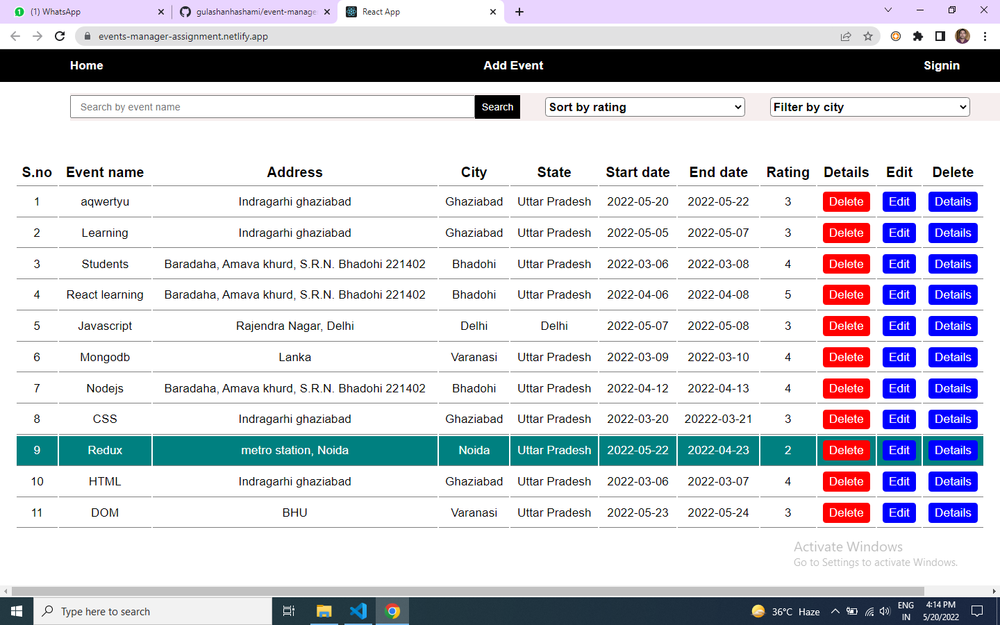
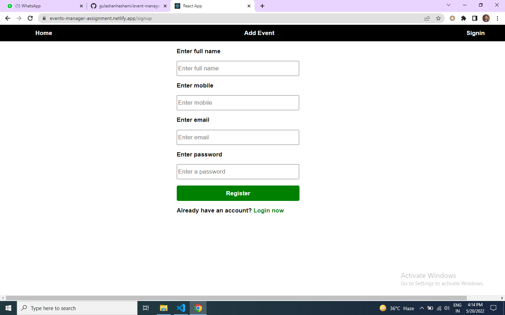
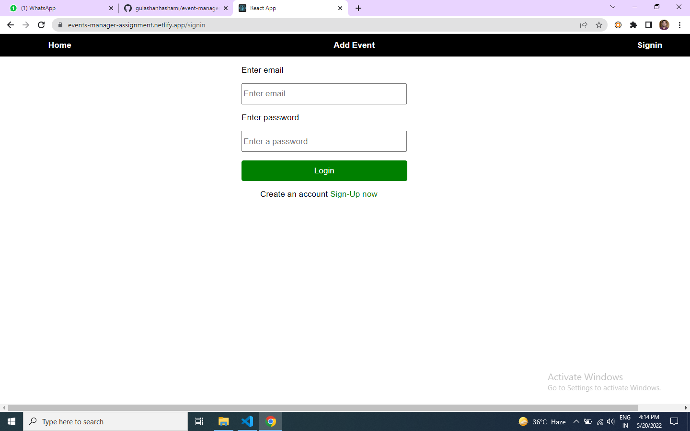
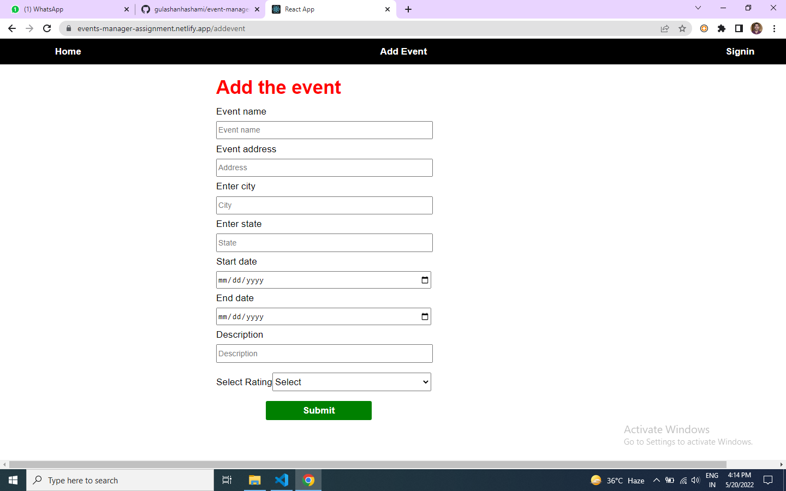
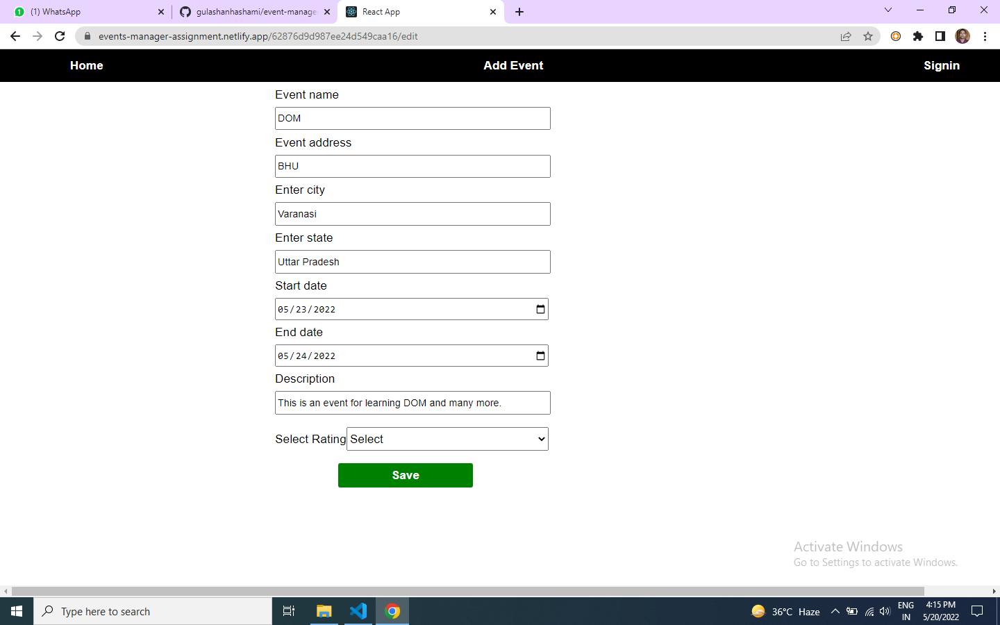

# Event manager

---

## This is an event management site. I used MERN stack to build this website. This is a fully responsive for all screen size.

# Prerequisities

- React.js
- HTML
- JavaScipt
- CSS 
- Styled-components
- Redux

# Run Locally

- To run this project locally follow following steps below
- Create folder in your local system

Clone this Project

`git pull https://github.com/gulashanhashami/event-manager-frontend.git`

- Now the project is ready just go and visit home page
- Live demo: https://events-manager-assignment.netlify.app/

Backend repo link of this project : https://github.com/gulashanhashami/eventManagerBackend.git

# Screenshots

> HOME PAGE

> SIGN-UP PAGE

> LOGIN PAGE

> ADD EVENT

>  EVENT DETAILS PAGE

> EDIT EVENT PAGE

# What did I Learn

- By end of this project, I am able to learn how effective work can be done when ideas are trajected in multiple spectrums.

- Effective learning involves how I was able to debug before we present our project.

